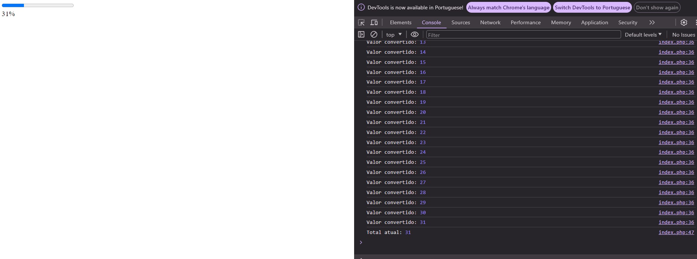
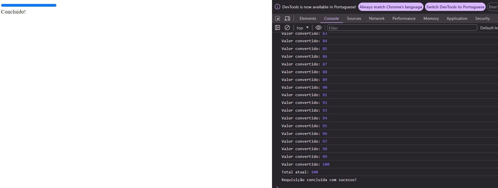

# Progressbar com Ajax e php

O projeto permite a realização de uma requisição ajax usando xrh ao carregar a página index.php essa requisição vai para a página principal.php que contém um loop ecoando os valores do progresso e usando a função sleep() para simular um processamento.<br>

Ao receber os valores no front-end é feita a atualização na barra de progresso <br>

## Progresso em andamento
<br>



## Progresso concluído
<br>



## Script Ajax
<br>
```
var total = 0;
        var xhr = new XMLHttpRequest();
        var url = 'principal.php';

        function iniciarStreaming() {
            var progressBar = document.getElementById('progressBar');
            var streamingContent = document.getElementById('streamingContent');
            xhr.onreadystatechange = function() {
                if (xhr.readyState === 3 && xhr.status === 200) {
                    var novoConteudo = xhr.responseText.substring(xhr.loaded);

                    // Divide os valores por quebra de linha
                    var valores = novoConteudo.trim().split('\n');

                    console.log("Valores recebidos:", valores);

                    for (var i = 0; i < valores.length; i++) {

                        var valorNumerico = parseFloat(valores[i].trim());

                        console.log("Valor convertido:", valorNumerico);

                        if (!isNaN(valorNumerico)) {
                            total = valorNumerico;
                            if (total > progressBar.value) {

                                progressBar.value = total;
                            }
                        }

                    }
                    console.log("Total atual:", total);

                    // Atualiza o conteúdo da div com o total
                    streamingContent.innerHTML = total + "%";

                    // Se o progresso não atingiu 100%, continue a requisição

                } else if (xhr.readyState === XMLHttpRequest.DONE && xhr.status === 200) {
                    // A requisição foi concluída com sucesso
                    console.log("Requisição concluída com sucesso!");
                    streamingContent.innerHTML = 'Concluído!';
                }
            };

        }
        if (total < 100) {
            setTimeout(iniciarStreaming, 5000);
        }
        xhr.open('GET', url, true);
        xhr.send();

        iniciarStreaming();
```
